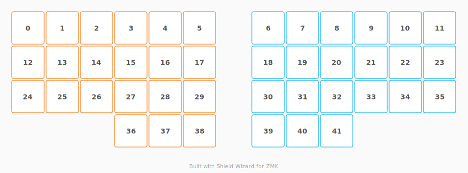

# ZMK Configuration for Flying Fox

*Generated by Shield Wizard for ZMK*



Download compiled firmware from the Actions tab. <https://zmk.dev/docs/user-setup#installing-the-firmware>

Edit your keymap <https://zmk.dev/docs/keymaps>.
User keymap is located at [`config/flying_fox.keymap`](config/flying_fox.keymap).

-----

<details>
<summary>
Shield Wizard Debug Information
</summary>

In case of broken configuration, here is the Shield Wizard internal data used to generate this configuration:

Commit: 76d20f55080c61b05c4de4221511db721e6ff538

```json
{"name":"Flying Fox","shield":"flying_fox","dongle":false,"modules":[],"layout":[{"id":"01KXNTE5MDQ2XRHSJMZ3X62ZD0","part":0,"row":1,"col":0,"w":1,"h":1,"x":-0.707106826289066,"y":0.927098954897487,"r":15,"rx":-0.207106826289071,"ry":1.42709895489749},{"id":"01KXNTE5MD994F43TM6SMNNTMZ","part":0,"row":0,"col":0,"w":1,"h":1,"x":-0.44828782628906605,"y":-0.038827045102519,"r":15,"rx":0.0517121737109342,"ry":0.461172954897481},{"id":"01KXNTE5MD6S9SYZ32TJ0GRKWQ","part":0,"row":0,"col":1,"w":1,"h":1,"x":0.517638,"y":0.21999200000000196,"r":15,"rx":1.017638,"ry":0.719992000000001},{"id":"01KXNTE5MD0EPAQ3WWWYW1BZZW","part":0,"row":1,"col":2,"w":1,"h":1,"x":1.538043,"y":0.939693,"r":20,"rx":2.038043,"ry":1.439693},{"id":"01KXNTE5MDSVTCX53903EBZWPM","part":0,"row":0,"col":2,"w":1,"h":1,"x":1.880064,"y":0,"r":20,"rx":2.380064,"ry":0.5},{"id":"01KXNTE5MDK9XPP37JKRK6ZZ9M","part":0,"row":0,"col":3,"w":1,"h":1,"x":2.909761,"y":0.09473300000000001,"r":20,"rx":3.409761,"ry":0.594733},{"id":"01KXNTE5MDX3KWX4JDYYC1WH3Q","part":0,"row":0,"col":4,"w":1,"h":1,"x":3.741448,"y":0.733498,"r":20,"rx":4.241448,"ry":1.233498},{"id":"01KXNTE5MDHXEJQ6G48N2HZDB6","part":1,"row":0,"col":7,"w":1,"h":1,"x":10.858552,"y":0.733497999999996,"r":-20,"rx":11.358552,"ry":1.233498},{"id":"01KXNTE5MD2VMWVGCQJA2MT3J8","part":1,"row":0,"col":8,"w":1,"h":1,"x":11.690239,"y":0.09473299999999596,"r":-20,"rx":12.190239,"ry":0.594733},{"id":"01KXNTE5MDQAF88RG0T6FT41D7","part":1,"row":0,"col":9,"w":1,"h":1,"x":12.719936,"y":-3.9968028886505635e-15,"r":-20,"rx":13.219936,"ry":0.5},{"id":"01KXNTE5MD6HBQ73N9ZYBNWRPJ","part":1,"row":1,"col":9,"w":1,"h":1,"x":13.061957,"y":0.939692999999996,"r":-20,"rx":13.561957,"ry":1.439693},{"id":"01KXNTE5MDKPFET27FS4C8FR1H","part":1,"row":0,"col":10,"w":1,"h":1,"x":14.082362,"y":0.21999199999999897,"r":-15,"rx":14.582362,"ry":0.719992000000001},{"id":"01KXNTE5MD0Q4NSMW7TSNW6TNA","part":1,"row":0,"col":11,"w":1,"h":1,"x":15.0482878262891,"y":-0.038827045102520996,"r":-15,"rx":15.5482878262891,"ry":0.461172954897481},{"id":"01KXNTE5MDW52C8XV0MH8RFB75","part":1,"row":1,"col":11,"w":1,"h":1,"x":15.3071068262891,"y":0.927098954897492,"r":-15,"rx":15.8071068262891,"ry":1.42709895489749},{"id":"01KXNTE5MDGS70SDQ0VQB2GFYT","part":0,"row":1,"col":1,"w":1,"h":1,"x":0.258819,"y":1.18591800000001,"r":15,"rx":0.758818999999998,"ry":1.68591800000001},{"id":"01KXNTE5MDBYV85RMQEAF8NEWT","part":0,"row":2,"col":1,"w":1,"h":1,"x":1.196023,"y":1.879385,"r":20,"rx":1.696023,"ry":2.379385},{"id":"01KXNTE5MDM3DPPEE1EKDEFTGD","part":0,"row":1,"col":3,"w":1,"h":1,"x":2.567741,"y":1.034425,"r":20,"rx":3.067741,"ry":1.534425},{"id":"01KXNTE5MDMRWTDPWDNYB7VNZV","part":0,"row":1,"col":4,"w":1,"h":1,"x":3.399428,"y":1.67319,"r":20,"rx":3.899428,"ry":2.17319},{"id":"01KXNTE5MDE08XE5MHX04MXGZQ","part":0,"row":0,"col":5,"w":1,"h":1,"x":4.61093598566743,"y":1.26840226207859,"r":20,"rx":5.11093598566743,"ry":1.76840226207859},{"id":"01KXNTE5MDHVC6PKRS1Y0X9RPN","part":1,"row":0,"col":6,"w":1,"h":1,"x":9.98906401433257,"y":1.26840226207858,"r":-20,"rx":10.4890640143326,"ry":1.76840226207859},{"id":"01KXNTE5MD6HWJES14GETFP6QX","part":1,"row":1,"col":7,"w":1,"h":1,"x":11.200572,"y":1.67319,"r":-20,"rx":11.700572,"ry":2.17319},{"id":"01KXNTE5MDH8APVTR511HD4TZZ","part":1,"row":1,"col":8,"w":1,"h":1,"x":12.032259,"y":1.034425,"r":-20,"rx":12.532259,"ry":1.534425},{"id":"01KXNTE5MDNNNZAT2ATR2GFQ3S","part":1,"row":2,"col":10,"w":1,"h":1,"x":13.403977,"y":1.879385,"r":-20,"rx":13.903977,"ry":2.379385},{"id":"01KXNTE5MD49HF683HEMRR64Z8","part":1,"row":1,"col":10,"w":1,"h":1,"x":14.341181,"y":1.18591800000001,"r":-15,"rx":14.841181,"ry":1.68591800000001},{"id":"01KXNTE5MDNVKZC4K70EA2EDXB","part":0,"row":2,"col":0,"w":1,"h":1,"x":0,"y":2.15184300000001,"r":15,"rx":0.499999999999998,"ry":2.65184300000001},{"id":"01KXNTE5MD80R1MQRC7EQDV44Y","part":0,"row":2,"col":2,"w":1,"h":1,"x":2.225721,"y":1.974118,"r":20,"rx":2.725721,"ry":2.474118},{"id":"01KXNTE5MDG3FDTX2WBTEYCQR1","part":0,"row":2,"col":3,"w":1,"h":1,"x":3.057407,"y":2.612883,"r":20,"rx":3.557407,"ry":3.112883},{"id":"01KXNTE5MD19J49P2Q0NS2JRAH","part":0,"row":1,"col":5,"w":1,"h":1,"x":4.26891598566743,"y":2.20809526207859,"r":20,"rx":4.76891598566743,"ry":2.70809526207859},{"id":"01KXNTE5MDQKV3X453EPAYV8GB","part":1,"row":1,"col":6,"w":1,"h":1,"x":10.3310840143326,"y":2.20809526207859,"r":-20,"rx":10.8310840143326,"ry":2.70809526207859},{"id":"01KXNTE5MD5S65XT558TE215ET","part":1,"row":2,"col":8,"w":1,"h":1,"x":11.542593,"y":2.612883,"r":-20,"rx":12.042593,"ry":3.112883},{"id":"01KXNTE5MDHF8BKN3FAKJ2MWXX","part":1,"row":2,"col":9,"w":1,"h":1,"x":12.374279,"y":1.974118,"r":-20,"rx":12.874279,"ry":2.474118},{"id":"01KXNTE5MDHPGZTGZPADY22TAP","part":1,"row":2,"col":11,"w":1,"h":1,"x":14.6,"y":2.15184300000001,"r":-15,"rx":15.1,"ry":2.65184300000001},{"id":"01KXNTE5MDM4S7P3XQ3Q243MG5","part":0,"row":3,"col":0,"w":1,"h":1,"x":2.69627681082173,"y":3.55122064475973,"r":20,"rx":3.19627681082173,"ry":4.05122064475972},{"id":"01KXNTE5MDBGN68JVWVKWPYC03","part":0,"row":2,"col":4,"w":1,"h":1,"x":3.92689598566743,"y":3.14778726207859,"r":20,"rx":4.42689598566743,"ry":3.64778726207859},{"id":"01KXNTE5MD50N7WZFS5B2RYNEQ","part":0,"row":2,"col":5,"w":1,"h":1,"x":4.90079062078591,"y":3.39583814332567,"r":20,"rx":5.40079062078591,"ry":3.89583814332567},{"id":"01KXNTE5MDYC0HKVF45XAPX3YC","part":1,"row":2,"col":6,"w":1,"h":1,"x":9.6992093792141,"y":3.39583814332567,"r":-20,"rx":10.1992093792141,"ry":3.89583814332567},{"id":"01KXNTE5MDPCDWVR42J7K5RESE","part":1,"row":2,"col":7,"w":1,"h":1,"x":10.6731040143326,"y":3.14778726207859,"r":-20,"rx":11.1731040143326,"ry":3.64778726207859},{"id":"01KXNTE5MDSWPYS9RZQPHMQFG8","part":1,"row":3,"col":11,"w":1,"h":1,"x":11.9037231891783,"y":3.55122064475973,"r":-20,"rx":12.4037231891783,"ry":4.05122064475972},{"id":"01KXNTE5MD2XDXGS467KQRNPHJ","part":0,"row":3,"col":1,"w":1,"h":1,"x":3.5675654029425,"y":4.08117931224258,"r":20,"rx":4.0675654029425,"ry":4.58117931224258},{"id":"01KXNTE5MD00G77M9RPBY3EG7H","part":0,"row":3,"col":2,"w":1,"h":1,"x":4.54146003806098,"y":4.32923019348965,"r":20,"rx":5.04146003806098,"ry":4.82923019348965},{"id":"01KXNTE5MD1V3K4KTT9JX0ZTQZ","part":1,"row":3,"col":9,"w":1,"h":1,"x":10.058539961939,"y":4.32923019348966,"r":-20,"rx":10.558539961939,"ry":4.82923019348965},{"id":"01KXNTE5MD3RSZXXXXNCSKE3RY","part":1,"row":3,"col":10,"w":1,"h":1,"x":11.0324345970575,"y":4.08117931224258,"r":-20,"rx":11.5324345970575,"ry":4.58117931224258}],"parts":[{"name":"left","controller":"nice_nano_v2","pins":{"d0":{"usage":"bus","bus":"spi0","role":"sck"},"d1":{"usage":"bus","bus":"spi0","role":"mosi"},"d2":{"usage":"device","deviceId":"01KXNTYSEZEP8TPN6N9AA9XX2H","role":"cs"},"d9":{"usage":"kscan","kscan":"01KXNTZG1CR51FQQ2XMMT2ZMEM","role":"input"},"d8":{"usage":"kscan","kscan":"01KXNTZG1CR51FQQ2XMMT2ZMEM","role":"input"},"d7":{"usage":"kscan","kscan":"01KXNTZG1CR51FQQ2XMMT2ZMEM","role":"input"},"d6":{"usage":"kscan","kscan":"01KXNTZG1CR51FQQ2XMMT2ZMEM","role":"input"},"d10":{"usage":"kscan","kscan":"01KXNTZG1CR51FQQ2XMMT2ZMEM","role":"output"},"d16":{"usage":"kscan","kscan":"01KXNTZG1CR51FQQ2XMMT2ZMEM","role":"output"},"d14":{"usage":"kscan","kscan":"01KXNTZG1CR51FQQ2XMMT2ZMEM","role":"output"},"d15":{"usage":"kscan","kscan":"01KXNTZG1CR51FQQ2XMMT2ZMEM","role":"output"},"d18":{"usage":"kscan","kscan":"01KXNTZG1CR51FQQ2XMMT2ZMEM","role":"output"},"d19":{"usage":"kscan","kscan":"01KXNTZG1CR51FQQ2XMMT2ZMEM","role":"output"},"d20":{"usage":"kscan","kscan":"01KXNTZG1CR51FQQ2XMMT2ZMEM","role":"output"}},"kscans":[{"kind":"matrix","id":"01KXNTZG1CR51FQQ2XMMT2ZMEM","diodes":true}],"keys":{"01KXNTE5MD00G77M9RPBY3EG7H":{"input":"d9","output":"d10"},"01KXNTE5MD2XDXGS467KQRNPHJ":{"input":"d9","output":"d16"},"01KXNTE5MDM4S7P3XQ3Q243MG5":{"input":"d9","output":"d14"},"01KXNTE5MD50N7WZFS5B2RYNEQ":{"input":"d8","output":"d10"},"01KXNTE5MDG3FDTX2WBTEYCQR1":{"input":"d8","output":"d14"},"01KXNTE5MDBGN68JVWVKWPYC03":{"input":"d8","output":"d16"},"01KXNTE5MD80R1MQRC7EQDV44Y":{"input":"d8","output":"d15"},"01KXNTE5MDBYV85RMQEAF8NEWT":{"input":"d8","output":"d18"},"01KXNTE5MDNVKZC4K70EA2EDXB":{"input":"d8","output":"d19"},"01KXNTE5MD19J49P2Q0NS2JRAH":{"input":"d7","output":"d16"},"01KXNTE5MDMRWTDPWDNYB7VNZV":{"input":"d7","output":"d14"},"01KXNTE5MDM3DPPEE1EKDEFTGD":{"input":"d7","output":"d15"},"01KXNTE5MD0EPAQ3WWWYW1BZZW":{"input":"d7","output":"d18"},"01KXNTE5MDGS70SDQ0VQB2GFYT":{"input":"d7","output":"d19"},"01KXNTE5MDQ2XRHSJMZ3X62ZD0":{"input":"d7","output":"d20"},"01KXNTE5MDE08XE5MHX04MXGZQ":{"input":"d6","output":"d16"},"01KXNTE5MDX3KWX4JDYYC1WH3Q":{"input":"d6","output":"d14"},"01KXNTE5MDK9XPP37JKRK6ZZ9M":{"input":"d6","output":"d15"},"01KXNTE5MDSVTCX53903EBZWPM":{"input":"d6","output":"d18"},"01KXNTE5MD6S9SYZ32TJ0GRKWQ":{"input":"d6","output":"d19"},"01KXNTE5MD994F43TM6SMNNTMZ":{"input":"d6","output":"d20"}},"encoders":[],"buses":{"spi0":{"type":"spi","devices":[{"id":"01KXNTYSEZEP8TPN6N9AA9XX2H","type":"niceview"}]}}},{"name":"right","controller":"nice_nano_v2","pins":{"d9":{"usage":"kscan","kscan":"01KXNV6N37TGD7AE8NDYQQS2KS","role":"input"},"d8":{"usage":"kscan","kscan":"01KXNV6N37TGD7AE8NDYQQS2KS","role":"input"},"d7":{"usage":"kscan","kscan":"01KXNV6N37TGD7AE8NDYQQS2KS","role":"input"},"d6":{"usage":"kscan","kscan":"01KXNV6N37TGD7AE8NDYQQS2KS","role":"input"},"d10":{"usage":"kscan","kscan":"01KXNV6N37TGD7AE8NDYQQS2KS","role":"output"},"d16":{"usage":"kscan","kscan":"01KXNV6N37TGD7AE8NDYQQS2KS","role":"output"},"d14":{"usage":"kscan","kscan":"01KXNV6N37TGD7AE8NDYQQS2KS","role":"output"},"d15":{"usage":"kscan","kscan":"01KXNV6N37TGD7AE8NDYQQS2KS","role":"output"},"d18":{"usage":"kscan","kscan":"01KXNV6N37TGD7AE8NDYQQS2KS","role":"output"},"d19":{"usage":"kscan","kscan":"01KXNV6N37TGD7AE8NDYQQS2KS","role":"output"},"d20":{"usage":"kscan","kscan":"01KXNV6N37TGD7AE8NDYQQS2KS","role":"output"}},"kscans":[{"kind":"matrix","id":"01KXNV6N37TGD7AE8NDYQQS2KS","diodes":true}],"keys":{"01KXNTE5MDHXEJQ6G48N2HZDB6":{"input":"d6","output":"d14"},"01KXNTE5MD2VMWVGCQJA2MT3J8":{"input":"d6","output":"d15"},"01KXNTE5MDQAF88RG0T6FT41D7":{"input":"d6","output":"d18"},"01KXNTE5MD6HBQ73N9ZYBNWRPJ":{"input":"d7","output":"d18"},"01KXNTE5MDKPFET27FS4C8FR1H":{"input":"d6","output":"d19"},"01KXNTE5MD0Q4NSMW7TSNW6TNA":{"input":"d6","output":"d20"},"01KXNTE5MDW52C8XV0MH8RFB75":{"input":"d7","output":"d20"},"01KXNTE5MDHVC6PKRS1Y0X9RPN":{"input":"d6","output":"d16"},"01KXNTE5MD6HWJES14GETFP6QX":{"input":"d7","output":"d14"},"01KXNTE5MDH8APVTR511HD4TZZ":{"input":"d7","output":"d15"},"01KXNTE5MDNNNZAT2ATR2GFQ3S":{"input":"d8","output":"d18"},"01KXNTE5MD49HF683HEMRR64Z8":{"input":"d7","output":"d19"},"01KXNTE5MDQKV3X453EPAYV8GB":{"input":"d7","output":"d16"},"01KXNTE5MD5S65XT558TE215ET":{"input":"d8","output":"d14"},"01KXNTE5MDHF8BKN3FAKJ2MWXX":{"input":"d8","output":"d15"},"01KXNTE5MDHPGZTGZPADY22TAP":{"input":"d8","output":"d19"},"01KXNTE5MDYC0HKVF45XAPX3YC":{"input":"d8","output":"d10"},"01KXNTE5MDPCDWVR42J7K5RESE":{"input":"d8","output":"d16"},"01KXNTE5MDSWPYS9RZQPHMQFG8":{"input":"d9","output":"d14"},"01KXNTE5MD1V3K4KTT9JX0ZTQZ":{"input":"d9","output":"d10"},"01KXNTE5MD3RSZXXXXNCSKE3RY":{"input":"d9","output":"d16"}},"encoders":[],"buses":{}}]}
```

</details>
